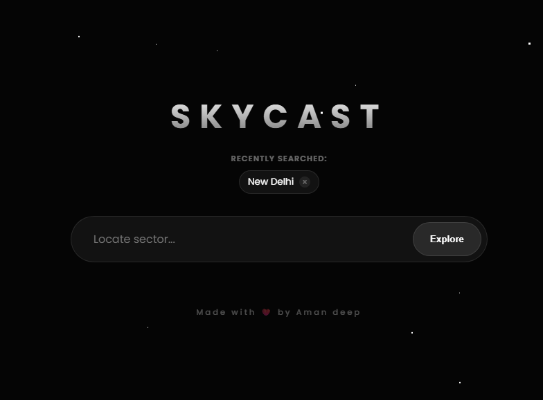
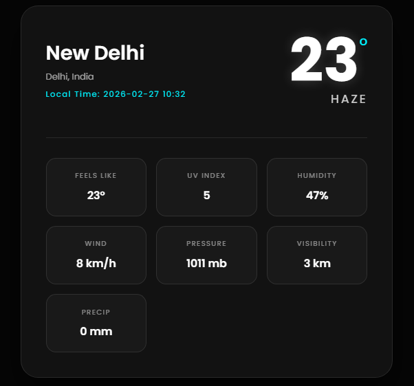

# 🌦️ SkyCast: Cosmic Weather Dashboard

[](https://opensource.org/licenses/MIT)


**SkyCast** is a premium weather application featuring an immersive **Cosmic Dark UI**. It provides real-time meteorological data with high-end glassmorphic effects and intelligent location search.

---

## 📸 Preview

### 🌌 Desktop Interface
<p align="center">
  
  
</p>
<p align="center">
  
  
</p>

*The main dashboard featuring a frosted-glass aesthetic and an animated 3D starfield.*

---

## ✨ Features

- [x] **Intelligent Geocoding:** Real-time city and country suggestions as you type via the Open-Meteo API.
- [x] **Comprehensive Metrics:** Tracks Temperature, Feels Like, UV Index, Humidity, Wind, Pressure, Visibility, and Precipitation.
- [x] **Search History:** Automatically saves the last successful searches to `localStorage` for instant re-fetching.
- [x] **Cosmic Aesthetic:** Three-layer parallax starfield with smooth drifting animations.
- [x] **Staggered Animations:** CSS-driven entrance effects for weather data tiles.

---

## 🛠️ Technical Implementation

### 🔌 API Architecture
SkyCast leverages two distinct APIs for a seamless experience:
* **Weatherstack API:** Delivers accurate, real-time weather data.
* **Open-Meteo API:** Powers the intelligent city suggestion and geocoding system.

### 🔐 Security Layer
The project follows a zero-exposure policy for API keys. All keys are stored in a local `apis.js` file, which is protected via `.gitignore` to prevent unauthorized usage.

### 🎨 Styling & Layout
* **Glassmorphism:** Uses `backdrop-filter: blur(20px)` and semi-transparent backgrounds.
* **Grid System:** Utilizes CSS Grid to organize distinct weather metrics in a clean, tile-based layout.

---

## 🚀 Installation & Setup

1. **Clone the Project**
   ```bash
   git clone [https://github.com/amandeepintl/SkyCast.git](https://github.com/amandeepintl/SkyCast.git)
   cd SkyCast
